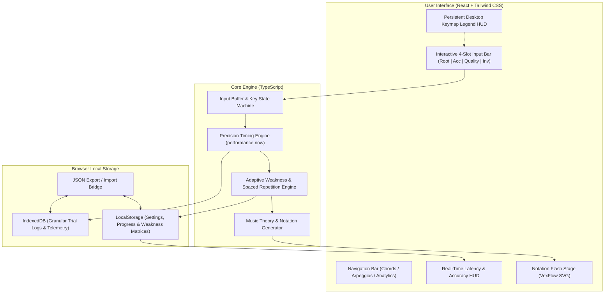
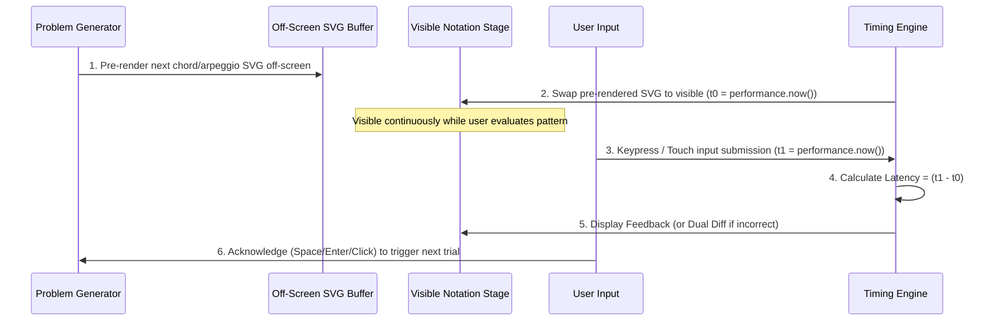

# Sheet Trainer — Technical Architecture & Implementation Plan

> [!NOTE]
> **Zero-Server Architecture**: This application runs 100% in the user's browser as a static Single Page Application (SPA / PWA). No backend, database, or external tracking is required. All user data, analytics, and weakness profiles persist locally.

---

## 1. System Architecture Overview



---

## 2. Tech Stack & Libraries

| Layer | Technology | Rationale |
| :--- | :--- | :--- |
| **Bundler & Dev Server** | **Vite** | Blazing fast builds, minimal bundle size, instant HMR. |
| **Framework & Language** | **React 18 + TypeScript** | Strong typing for complex music theory entities, predictable state transitions, component modularity. |
| **Styling & Design System** | **Tailwind CSS** | Zero-runtime CSS, mobile-first responsive utility classes, native dark-mode support. |
| **Music Notation Engine** | **VexFlow (v4/v5)** | High-precision vector SVG rendering, robust accidental/stem/beam rules, crisp on Retina/mobile screens. |
| **Icons & UI Extras** | **Lucide React** | Lightweight, clean SVG icons for settings, stats, and navigation. |
| **Persistence Layers** | **LocalStorage + `idb-keyval`** | Synchronous fast reads for app state; asynchronous IndexedDB for heavy telemetry logging. |

---

## 3. Clean Separation of Settings vs. Progress

To maintain a clean architectural boundary:
* **`settings`:** User preferences and configurations (what the user controls).
* **`progress`:** Achievements, streaks, unlocked tiers, and weakness analytics (what the system records).

### Tier 1: `LocalStorage` (`sheet_trainer_state_v1`)

```typescript
interface AppState {
  version: number;
  
  // 1. USER CONFIGURATIONS & PREFERENCES
  settings: {
    theme: 'dark' | 'light' | 'system';
    showKeymapLegend: boolean;          // Default: true on desktop
    chords: TrackSettings;
    arpeggios: TrackSettings;
  };

  // 2. USER ACHIEVEMENTS, STATE & ANALYTICS
  progress: {
    chords: TrackProgress;
    arpeggios: TrackProgress;
  };
}

interface TrackSettings {
  clef: 'treble' | 'bass' | 'grand';    // Default: 'treble'
  inputMode: 'direct_entry' | 'multiple_choice';
  flashMode?: 'fixed' | 'adaptive';
  flashDurationMs?: number;
  feedbackDelayMs?: number;
  keyMode: 'progressive' | 'locked' | 'all_unlocked';
  activeKeyId: string;                  // e.g. 'C', 'G', 'Am'
}

interface TrackProgress {
  currentTier: number;                  // e.g. 1.1, 1.2, 3.1...
  highestStreak: number;
  currentStreak: number;
  totalTrialsCompleted: number;
  masteredTiers: number[];              // List of completed tier IDs
  unlockedKeyStages: number[];          // Circle of Fifths stages (0 to 4)
  masteredKeys: string[];               // Mastered key signature IDs
  weaknessMatrix: Record<string, PatternStats>;
}

interface PatternStats {
  totalSeen: number;
  correctCount: number;
  avgLatencyMs: number;
  lastAttemptTimestamp: number;
}

export type VoicingType = 'close' | 'drop2' | 'drop3';

export interface ChordDefinition {
  id: string;
  root: NoteLetter;
  rootAccidental: Accidental;
  quality: ChordQuality;
  inversion: Inversion;
  notes: NotePitch[];
  clef: Clef;
  tier: number;
  displayName: string;
  voicing?: VoicingType;
  omit5?: boolean;
  keySignature?: KeySignatureDefinition;
}
```

### Tier 2: `IndexedDB` (Telemetry & Granular Trial Logs)
Every trial creates an immutable log entry in object store `trials`:

```typescript
interface TrialLog {
  id: string;              // UUID
  timestamp: number;       // Epoch ms
  track: 'chords' | 'arpeggios';
  clef: 'treble' | 'bass' | 'grand';
  patternId: string;       // e.g., "C#_MIN_1ST_INV" or "G_MAJ_ASC_ROOT"
  root: string;            // "C#"
  quality: string;         // "minor"
  inversionOrShape: string;// "1st" or "ascending"
  flashDurationMs: number; // Exposure duration (0 for untimed)
  latencyMs: number;       // Response time from reveal
  isCorrect: boolean;
  userInput: string;
  correctAnswer: string;
  keySignature?: string;
}
```

---

## 4. Chord Input UX & State Machine (Direct Entry)

To eliminate key collisions (such as the letter `F` meaning Note **F** vs. **Flat ♭**) and make chord entry lightning-fast ($<0.5\text{s}$), the trainer uses an **Auto-Advancing 4-Slot Buffer**.

```
┌────────────────────────────────────────────────────────────────────────┐
│                        SLOT BUFFER DISPLAY (UI)                        │
├───────────────────┬───────────────────┬───────────────────┬────────────┤
│   [ 1. ROOT ]     │  [ 2. ACCIDENTAL] │   [ 3. QUALITY ]  │ [ 4. INV ] │
│        C          │         ♯         │         m         │    1st     │
└───────────────────┴───────────────────┴───────────────────┴────────────┘
```

### How the State Machine Handles Input (Zero Friction):

1. **Slot 1 — Root Note:** Press `A`, `B`, `C`, `D`, `E`, `F`, or `G`.
   * *Slot 1 fills immediately.* State advances to Slot 2.
2. **Slot 2 — Accidental (Optional / Auto-Skip):**
   * Press `S` or `#` for **Sharp (♯)**.
   * Press `B` or `-` for **Flat (♭)**. (Since Root is already chosen, `B` safely maps to Flat).
   * *Smart Skip:* If the note is natural, typing a Quality key (like `m` or `M`) fills natural by default and jumps directly to Slot 3!
3. **Slot 3 — Quality / Type:**
   * Press `M` for **Major**, `m` for **Minor**, `d` for **Dim**, `a` for **Aug**, `7` for **Dom7**, `j` for **Maj7**, `k` for **Min7**, `h` for **Half-Dim**, `4` for **Sus4**, `2` for **Sus2**, `9` for **9**, `6` for **6**.
   * *Slot 3 fills.* State advances to Slot 4 (or auto-submits in fixed-inversion / drop tiers).
4. **Slot 4 — Inversion (Auto-Submit):**
   * Press `0` or `r` for **Root Pos**, `1` for **1st Inv**, `2` for **2nd Inv**, `3` for **3rd Inv**.
   * *Immediate Auto-Submit:* The moment the inversion key is pressed, the answer is evaluated instantly.

> **Real-World Typing Examples:**
> * $C\text{ minor 1st inv} \rightarrow$ Type: `c` $\rightarrow$ `m` $\rightarrow$ `1` (3 keystrokes, $\approx 300\text{ms}$)
> * $F\sharp\text{ Maj root pos} \rightarrow$ Type: `f` $\rightarrow$ `s` $\rightarrow$ `M` (3 keystrokes in Tier 1.1 due to fixed inversion auto-skip)
> * $B\flat\text{ dim 2nd inv} \rightarrow$ Type: `b` $\rightarrow$ `b` $\rightarrow$ `d` $\rightarrow$ `2` (4 keystrokes)

---

## 5. Input Modes & Desktop Keymap Legend

The user can configure input modes independently for Chords and Arpeggios:

```
┌────────────────────────────────────────────────────────┐
│                  AVAILABLE INPUT MODES                 │
├──────────────────────────┬─────────────────────────────┤
│ 1. Direct Entry Buffer   │ 2. Rapid Multiple Choice    │
│ (Type full chord in 3-4  │ (Pick from 4 smart          │
│  instant strokes)        │  distractor cards: 1-4)     │
└──────────────────────────┴─────────────────────────────┘
```

### Persistent Desktop Keymap Legend HUD
On desktop, a slim cheat sheet stays visible during direct entry:

```
┌────────────────────────────────────────────────────────────────────────────────────────┐
│ [A-G] Root | [S]♯ [B]♭ [Space]♮ | [m]Min [M]Maj [d]Dim [a]Aug [7]Dom7 [j]Maj7 | [0-3] Inv│
└────────────────────────────────────────────────────────────────────────────────────────┘
```

---

## 6. Precision Latency Timing & Double-Buffering

The trainer provides smooth, instantaneous visual transitions without cumulative layout shifts (CLS) or visual jitter.



1. **Pre-rendering (Double-Buffering):** Notation SVGs are generated ahead of time in an off-screen container. Swapping them into view takes $<1\text{ms}$ with zero DOM recalculation lag.
2. **High-Resolution Timers:** All timestamps use `performance.now()` (monotonic sub-millisecond precision) rather than `Date.now()`.
3. **Fixed Stage Dimensions:** The notation stage has a locked height ($295\text{px}$ mobile / $350\text{px}$ desktop), eliminating Cumulative Layout Shift (CLS).

---

## 7. Adaptive Problem Generation Algorithm

The generator selects the next pattern using a weighted probability distribution derived from historical error rates and reaction latency within the **active track**:

$$\text{Weight}(p) = 1.0 + \left(2.5 \times \text{ErrorRate}(p)\right) + \min\left(\frac{\text{AvgLatencyMs}(p)}{1000}, 2.0\right)$$
*(Unseen patterns receive a baseline weight of $1.5$)*

* **Weakness Amplification:** Patterns with higher error rates and latencies receive higher sampling probability ($40\%$ bias toward current tier weaknesses).
* **Diatonic Key Sampling:** When a key signature is active, $80\%$ of problems sample diatonic scale degrees for that key.
* **Tier Mastery Criteria:** Achieving $\ge 85\%$ accuracy and $\le 2000\text{ms}$ ($2.0\text{s}$) average latency over 20 consecutive trials unlocks Tier and Key Mastery.

---

## 8. Component & File Hierarchy

```
sheet_trainer/
├── public/
│   ├── favicon.svg
│   ├── manifest.webmanifest
│   └── sw.js
├── src/
│   ├── components/
│   │   ├── Navigation.tsx           # Top-level navigation bar & route switcher
│   │   ├── TrackHeader.tsx          # Active tier ribbon & curriculum modal button
│   │   ├── NotationStage.tsx        # VexFlow SVG renderer with double-buffer & diff pane
│   │   ├── SlotBufferInput.tsx      # 4-slot direct entry visual display & touch matrix
│   │   ├── MultipleChoicePad.tsx    # 4-card rapid distractor pad
│   │   ├── KeymapLegendHUD.tsx      # Persistent desktop keymap cheat sheet HUD
│   │   ├── StatsHUD.tsx             # Real-time streak, accuracy & latency HUD
│   │   ├── AnalyticsView.tsx        # Weakness breakdown, trial telemetry & JSON backup
│   │   ├── TierSelector.tsx         # Curriculum roadmap modal with theory hints
│   │   ├── CircleOfFifthsModal.tsx  # 15 paired key signatures modal
│   │   └── SettingsModal.tsx        # Clef, input mode, key legend & storage settings
│   ├── core/
│   │   ├── theory/
│   │   │   ├── notes.ts             # Pitch, clef bounds, accidentals & MIDI
│   │   │   ├── keys.ts              # 15 key signatures, Circle of Fifths & diatonic degrees
│   │   │   ├── chords.ts            # Triads, 7ths, inversions, voicings & octave bounds
│   │   │   ├── arpeggios.ts         # Contours, starting degrees, beaming & ranges
│   │   │   ├── tierHints.ts         # Visual cues, recognition cheat codes & formulas
│   │   │   └── vexflowAdapter.ts    # VexFlow SVG chord & arpeggio rendering adapter
│   │   └── engines/
│   │       ├── stateMachine.ts      # 4-slot buffer input state machine
│   │       ├── adaptiveEngine.ts    # Weakness weighting, key sampling & mastery evaluation
│   │       ├── distractorEngine.ts  # Context-aware multiple-choice trap generator
│   │       └── timingEngine.ts      # Sub-millisecond latency stopwatch
│   ├── storage/
│   │   ├── localStore.ts            # LocalStorage state management & device detection
│   │   ├── telemetryStore.ts        # IndexedDB trial logging (idb-keyval)
│   │   └── exportImport.ts          # JSON backup export and restore utilities
│   ├── types/
│   │   └── index.ts                 # Full TypeScript domain models
│   ├── App.tsx                      # Root application controller & game loop
│   ├── main.tsx                     # React DOM entrypoint
│   └── index.css                    # Tailwind CSS directives & VexFlow dark-mode styles
├── scripts/
│   └── verify.ts                    # 115-test automated verification suite
├── package.json
├── tsconfig.json
├── tailwind.config.js
└── vite.config.ts
```
